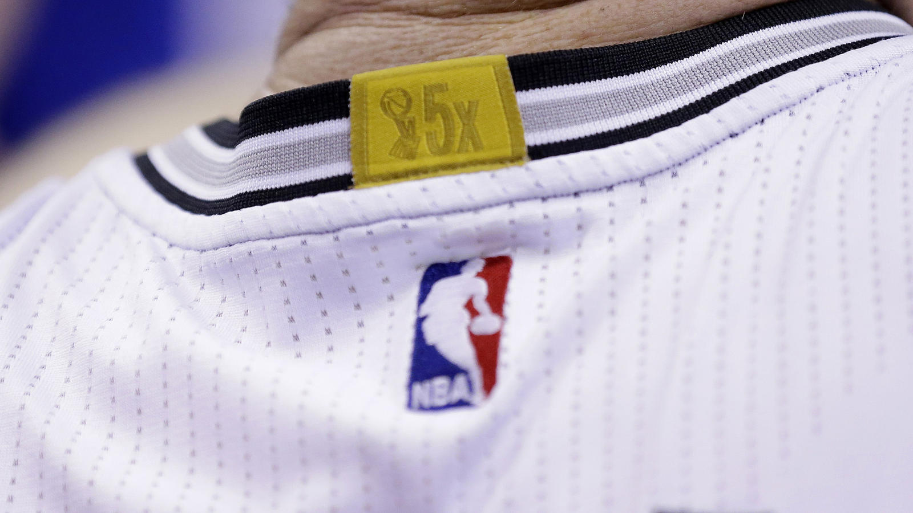
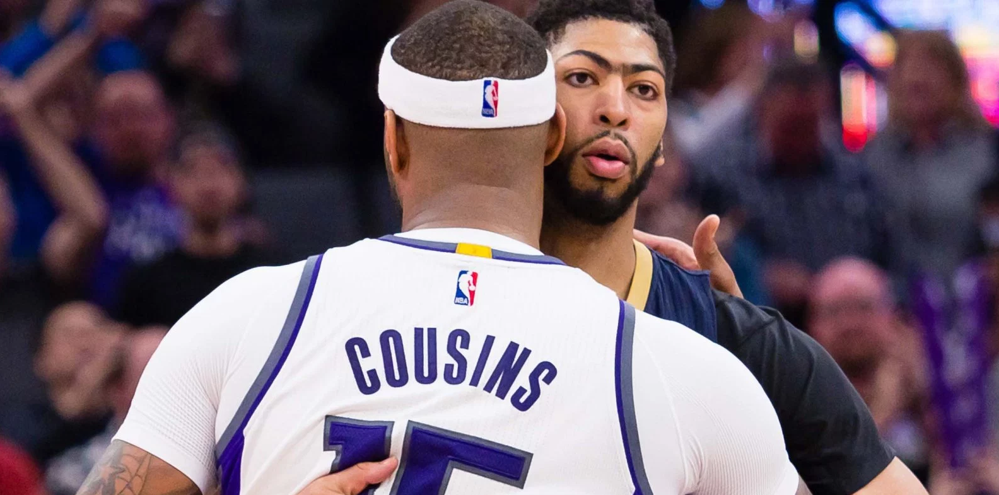

# Who Deserves the NBA's Championship Jersey Patch?

The nba introduced the gold patch in 2014.  It sends a clear and valuable message: it is hard to win an nba championship.  Nearly half the teams have never done it.  As of the 2018 season, 17 of the leagues 30 teams wear the patch.  The remaining 13 do not.  

But for the devout fan, this strikes an unexpected nerve: it’s seems that even fewer teams have won championships.  League-pass aficionados cannot help but feel a flicker of doubt upon seeing sights like this: 

The tiers:

* Tier 1: Undisputed Champions
* Tier 2: The Disputed
* Tier 3: No Badges

## Tier 1: Undisputed Champions

### Tier 1a: The Perma-Dynasties

* Boston Celtics (16x)
* Los Angeles Lakers (16x)

The NBA has always been a league of dynasties.  And nearly from its inception, the league has seen two perma-dynasties in conflict for historical supremacy.  Their success extends through the nbas history, from its earliest days to their modern-era championships in 2008-10. 

### Tier 1b: The Uni-Dynasties

* Chicago Bulls (6x)
* San Antonio Spurs (5x)

### Tier 1c: The Modern Champions

In order of recency: 

* Golden State Warriors (6x)
* Cleveland Cavaliers (1x)
* Dallas Mavericks (1x)
* Miami Heat (2x)
* Detroit Pistons (3x)
* Houston Rockets (2x)

The next two tiers illustrate just how difficult it has been to win an NBA championship, and how much more difficult to win more than one or two. 

One team of this group proves particularly difficult to categorize: the league's ongoing powerhouse, Golden State.  We understand applying of the term “dynasty” to the Spurs and Bulls of Tier 1b, but not to the Warriors of Tier 1c, may prove distracting.  This is not our aim. (GSW may in fact deserve a tier of its own, in between the two.)  While sports media may obsessively debate the definitions of terms such as “dynasty” or “elite”, here we have no such goal.  Our goals are exposing the fraudulent badge-wearers, and celebrating the real ones.  And all of these teams qualify as real.  

## Tier 3: No Badges

No, we did not mis-count tiers here.  Our interest really lies in Tier 2, with the teams under dispute.  We'll address them last.  First we'll cover the teams in our bottom tier: non-badge wearers. 

The 13 teams without badges, and their years of entry into the NBA: 

### Tier 3a: No Patch, *Some* Claim

* Oklahoma City Thunder (1967 / 2008)

Only one non-badge team has a conceivable claim to wearing one.  The Thunder's predecessor, the Seattle Supersonics, won the 1979 championship.  Per their separation terms with Seattle, the OKC franchise owns the Supersonics records, and [reportedly](https://sports.yahoo.com/oklahoma-city-s-thunder-decline-to-celebrate-seattle-s-1979-championship-with-a-jersey-patch-190633234.html?y20=1) were offered the choice of whether to wear the gold patch.  They declined.  And we wholeheartedly agree.

### Tier 3b: The Never-Champions

* Phoenix Suns (1968)
* Los Angeles Clippers (1970)
* Utah Jazz (1974)
* Denver Nuggets (1976)
* Indiana Pacers (1976)
* Brooklyn Nets (1976)
* Charlotte Hornets (1988)
* Minnesota Timberwolves (1989)
* Orlando Magic (1989)
* Toronto Raptors (1995)
* Memphis Grizzlies (1995)
* New Orleans Pelicans (2002)

This list really shows how hard it is to win in the NBA.  Of the twelve never-champion franchises, half are relatively modern expansion teams, starting in the 1980s or later.  The other six have had a rough life.  Three of the four teams who moved from the ABA have never won championships (the sole exception being San Antonio).  And three franchises which began even before the ABA merger - Utah, Phoenix, and the Clippers - have never tasted gold. 

## Tier 2: The Disputed Lands

Now that we've established the ten teams which undisptuably deserve the championship patch, and the thirteen which do not, we can dig into the teams at issue. 

First, we should establish a set of *principles for patches*.

* *Moving or renaming the team, forfeits rights to previously-earned patches.*
  * This does not include "in-area" moves, such as the Nets from New York, to New Jersey, and back to Brooklyn, or the Warriors changes from San Francisco to "Golden State". 
* *At some point, championships time out.*
  * Just *when* is a topic we'll discuss in depth.  But the underlying principle is that championships can get too old for patch eligibility.  Both the passage of time and the evolution of the league make championships from, say, the 1950s less relevant that those of today.  Degrees matter here; older titles are less relevant than newer ones. 
* *Multiple championships count for more.* 

Note we do not advocate the revocation of any team's *championships*.  These are clearly events which happened.  (And this isn't the NCAA!)  Every championship team won the only way it could: by beating the opponents placed in front of them.  Their era, relative competition, and circumstances were not up to them.  But the jersey patch is a separate matter.  In essence the *principles* inform a set of criteria by which championship wins can be patch-eligible, or not.  

While there is room for subtlety in setting these criteria, there is little debate that two teams make mockery of the patch. 

### Tier 2b: Absolute Jokes

* Atlanta Hawks (1x, 1958)
* Sacramento Kings (1x, 1951)

These two teams come off either as total wanna-be's, or just delusional.  (And were among the motivation for this writing.)  The Kings' sole championship came as the Rochester Royals in 1951, and the Hawks' came as the St Louis Hawks in 1958.  Both violate both of our principles for patches: they are super-old, and both teams have moved.  One changed names to boot.  The retention of the name "Hawks" is really the only bright spot here. 

If there is no other take-away from this article, let it be a reminder of how pathetic these two teams look. 

### Tier 2a: The Borderline 

This leaves five teams on the fringe.  In order of most recent titles:

* Philadelphia 76ers (3x: 1955, 67, 83)
* Washington Bullets/ Wizards (1x: 1978)
* Portland Trail Blazers (1x: 1977)
* New York Knicks (2x: 1970, 73)
* Milwaukee Bucks (1x: 1971)

These teams share a common thread: each has been in their cities for a long time - and have not won in a long time.  They are the real test of our question as to *when* championships should time out.  This could be a rolling period of time, e.g. the past 30 years.  Or we could use one of the major milestones in league history.  The latter can track against major changes in the state of the league.  Today's champions have a tougher road to climb than teams before them did.  It was far less competitive - easier - to win in 1958, in a league of eight teams in which most players needed summer jobs.  The modern NBA has both expanded in teams and in geography, but most importantly in impact.  There is far more money on the line today, and far more incentive to win. 

But just when should these championships "time out"?  To start, we can consider the major events and eras of the league's history:

* League Founding: 1946
* Racial Integration: 1950
* NBA-ABA Merger: 1976
* Three Point Line Introduced: 1979
* Magic/Bird Era Begins: 1979
* Jordan Era Begins: 1984
* Unrestricted Free Agency: 1988
* Lebron Era Begins: 2003

It can also help to review the league's champions by year.  A funny phenomenon happened in the late 1970s:

* 1975: Golden State Warriors
* 1976: Boston Celtics
* 1977: Portland Trail Blazers
* 1978: Washington Bullets
* 1979: Seattle Supersonics

For half a decade, the typically dynastic NBA was all but overturned with upstart, one-time champions.  This list looks more believable for the modern NFL, where teams' fortunes rise and fall on a yearly basis.  Three of the five champions from this span have never won another title.  A fourth (Golden State) failed to for the next 40 years. 

What happened?  Bill Simmons's *Book of Basketball* tells great tales from this era, many from young Simmons' first-person perspective.  Two factors are particularly relevant.  First, the league had reached a nadir in popularity.  Its biggest games were not being aired on live TV.  Broad perception was that the NBA was *too black*, and could never be connect with mainstream American audiences.  Second, this was the *cocaine era*.  Tales abound of players' drug problems, affects on their careers and in-season performance.  (These two factors are of course inter-related.) 

### The Cut-Off

This informs our view of when to cut off patch-eligibility:  

* Championships from the cocaine era no longer count.  
* Nor do championships from before it.  

The end of the cocaine era coincides with the 1979 introduction of the three-point line, and the same year's entry of Larry Bird and Magic Johnson.  The same season included Magic Johnson's famed NBA Finals triple-double, filling in at center for an injured Kareem Abdul-Jabbar.  This is where, for our purposes, the modern NBA begins: with the 1979-80 season.  

The championships of the Bucks, Knicks, Blazers, and Bullets/ Wizards, are therefore left patch-ineligible.  All of these titles are now more than 40 years old.  Two of the four were one-time events, in a uniquely strange period in league history.  (And note Washington is a fringe case in the relocation/ renaming rule.)

Of the borderline teams, only the 76ers 1983 championship remains patch-eligible.  Despite only five years passing between them, this championship seems far more current than the next most-recent Borderline team's championship (Washington in 1978).  This further reinforces the choice of 1979 as the cut-off season. 

## The New Patch List

Six of the league's seventeen gold patches deserve to be revoked.  Two (Atlanta and Sacramento) ever only had laughable claims.  Four more (Milwaukee, New York, Portland, Washington) have claims which can be argued - but we find their championships to be outdated, from a begone era of NBA basketball. 

After the patch reshuffling:

### Patches

* *Tier 1a: The Perma-Dynasties*
	* Boston Celtics (16x)
	* Los Angeles Lakers (16x)
* *Tier 1b: The Uni-Dynasties*
	* Chicago Bulls (6x)
	* San Antonio Spurs (5x)
* *Tier 1c: The Modern Champions*
	* Golden State Warriors (6x)
	* Cleveland Cavaliers (1x)
	* Dallas Mavericks (1x)
	* Miami Heat (2x)
	* Detroit Pistons (3x)
	* Houston Rockets (2x)
* *Tier 1d: The Borderline*
	* Philadelphia 76ers (3x: 1955, 67, 83)

### No Patches 

* *Tier 2a: Revoked*
	* Washington Bullets/ Wizards (1x: 1978)
	* Portland Trail Blazers (1x: 1977)
	* New York Knicks (2x: 1970, 73)
	* Milwaukee Bucks (1x: 1971)
* *Tier 2b: Absolute Jokes*
	* Atlanta Hawks (1x, 1958)
	* Sacramento Kings (1x, 1951)

* *Tier 3a: No Patch, Some Claim*
	* Oklahoma City Thunder (Founded 1967 / 2008)
* *Tier 3b: The Never-Champions*
	* Phoenix Suns (1968)
	* Los Angeles Clippers (1970)
	* Utah Jazz (1974)
	* Denver Nuggets (1976)
	* Indiana Pacers (1976)
	* Brooklyn Nets (1976)
	* Charlotte Hornets (1988)
	* Minnesota Timberwolves (1989)
	* Orlando Magic (1989)
	* Toronto Raptors (1995)
	* Memphis Grizzlies (1995)
	* New Orleans Pelicans (2002)

